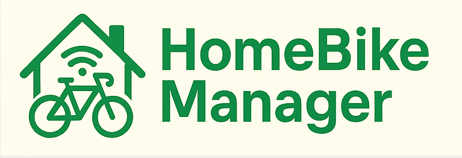

# HomeBikeManager Documentation

Welcome to the HomeBikeManager documentation. This guide covers everything you need to develop, deploy, and use the HomeBikeManager Flask REST API.

## System Overview

*Figure 1: High-level concept diagram of the HomeBikeManager system, showing users, API, database, uploads, and main entities. This diagram provides a bird's-eye view of how the main components interact, including user actions, API endpoints, persistent storage, and the relationships between bikes, parts, rides, and calendar events.*

## Architecture & Workflows

### API Endpoints Map

*Figure 2: This diagram shows the main REST API endpoints, their relationships, and how the API is organized. Each rectangle represents a resource (e.g., bikes, parts, rides), and arrows indicate management or interaction flows. Use this as a quick reference for endpoint structure and resource responsibilities.*

### Database Schema

*Figure 3: The database schema diagram illustrates the main models (User, Bike, Part, Ride, CalendarEvent) and their relationships. This helps developers understand how data is structured, how entities are linked, and how to extend the schema for new features.*

### Authentication Flow

*Figure 4: This diagram details the authentication process, from user registration and login to API key issuance and request validation. It clarifies the security model and the steps required for secure access to the API.*

### File Upload Workflow

*Figure 5: This workflow shows how file uploads (GPX/KML) are validated, stored, and linked to rides. It covers validation, storage, and the connection between uploaded files and ride records.*

### Deployment Architecture

*Figure 6: The deployment architecture diagram shows how the app, Docker container, database volume, uploads, and client interact. Use this to understand how to deploy, scale, and persist data in production.*

## Project Status (as of July 2025)
- User registration, login, and API key authentication are implemented and tested.
- Bike and part endpoints are implemented and tested.
- Models for rides and calendar events exist, but endpoints and file upload logic are not yet implemented.
- Dockerfile and requirements.txt are present and functional.
- Pytest-based tests cover authentication, bikes, and parts.
- Logging is set up using Python’s logging module.
- File upload, advanced authentication, and calendar/ride endpoints are pending.

## Contents
- [[Setup & Installation]]
- [[API Reference]]
- [[File Uploads]]
- [[Authentication]]
- [[Docker & Deployment]]
- [[Testing]]
- [[Logging & Debugging]]
- [[Contributing]]
- [[FAQ]]
